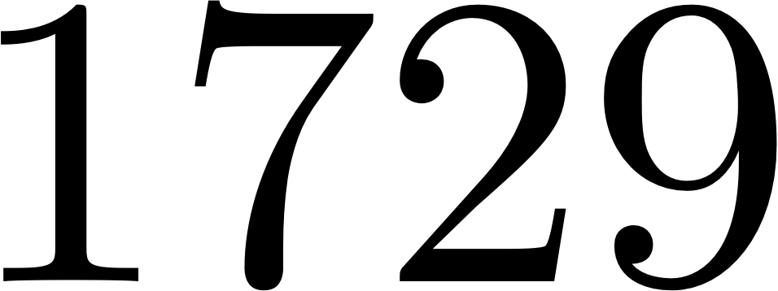
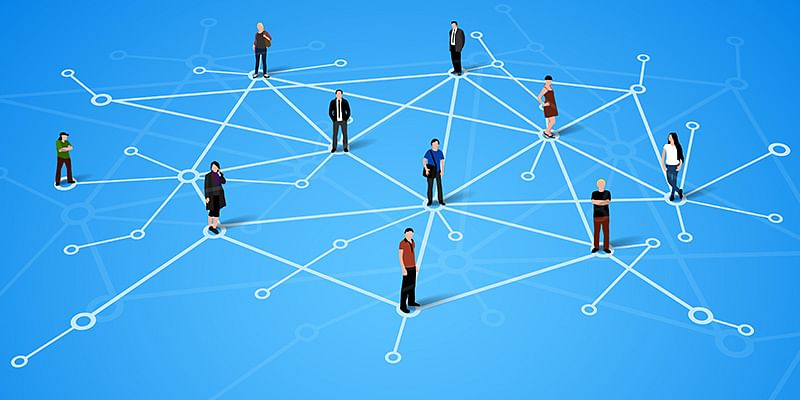
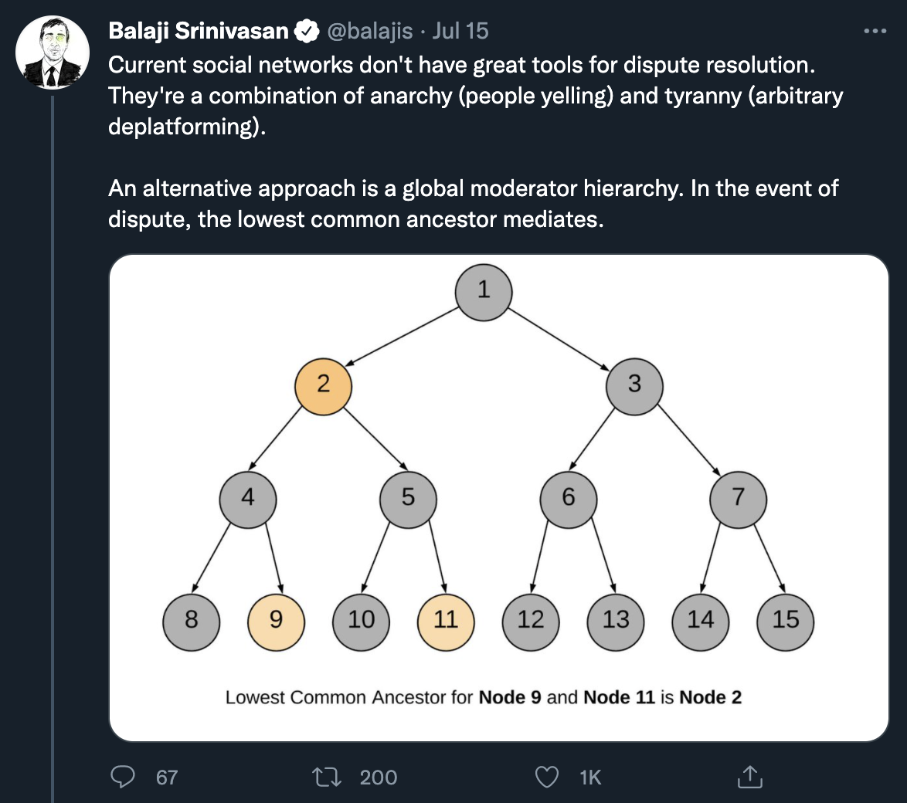
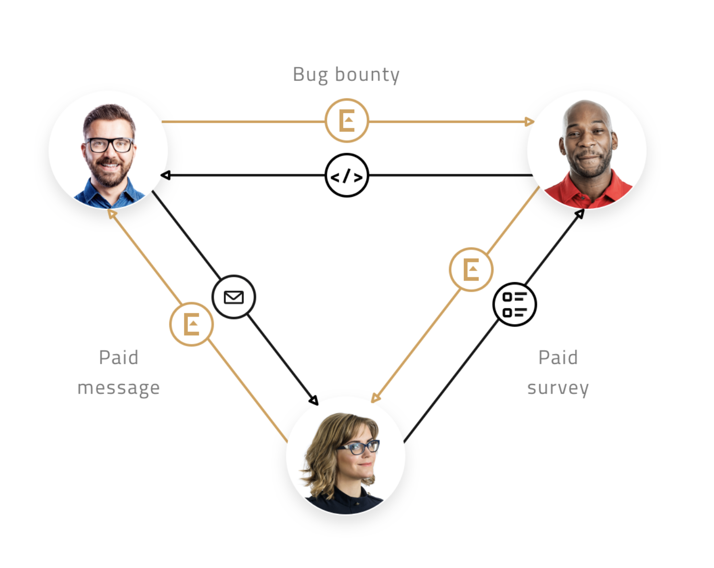
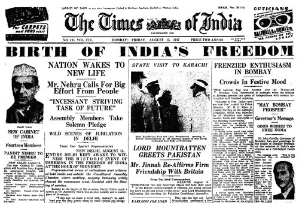
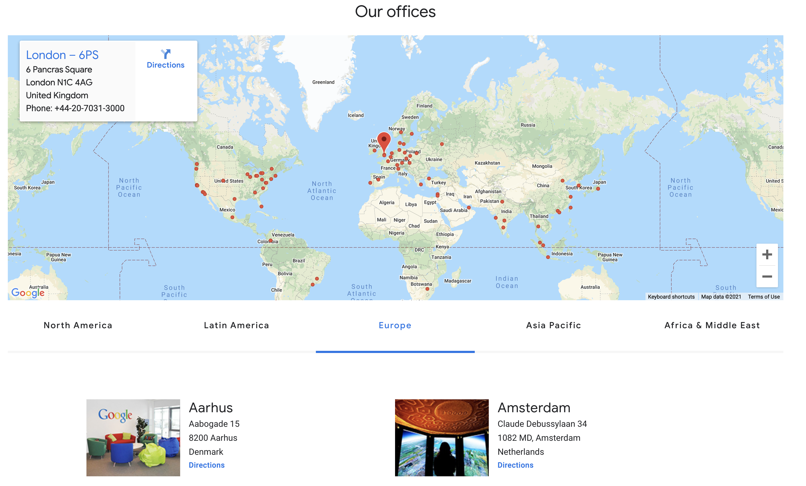

# Lecture 0: Summary
The Network State in one sentence, with illustrations.
1729.com/summary

[balajis]: https://twitter.com/balajis
[1729]: https://1729.com
[1729-content]: https://github.com/1729/content
[1729-twitter]: https://twitter.com/oneseventwonine
[lecture1-essay]: https://1729.com/the-network-state

---
# One Sentence

A **network state** is a social network with a clear leader, an integrated
cryptocurrency, a definite purpose, a sense of national consciousness,
and a plan to crowdfund territory.

---
# One Sentence

A network state is a **social network** with a clear leader, an integrated
cryptocurrency, a definite purpose, a sense of national consciousness,
and a plan to crowdfund territory.

---
# One Sentence

A network state is a social network with a **clear leader**, an integrated
cryptocurrency, a definite purpose, a sense of national consciousness,
and a plan to crowdfund territory.

---
# One Sentence

A network state is a social network with a clear leader, **an integrated
cryptocurrency**, a definite purpose, a sense of national consciousness,
and a plan to crowdfund territory.

---
# One Sentence

A network state is a social network with a clear leader, an integrated
cryptocurrency, a **definite purpose**, a sense of national consciousness,
and a plan to crowdfund territory.

---
# One Sentence

A network state is a social network with a clear leader, an integrated
cryptocurrency, a definite purpose, **a sense of national consciousness**,
and a plan to crowdfund territory.

---
# One Sentence

A network state is a social network with a clear leader, an integrated
cryptocurrency, a definite purpose, **a sense of national consciousness**,
and a plan to crowdfund territory.

---
# One Sentence

A network state is a social network with a clear leader, an integrated
cryptocurrency, a definite purpose, **a sense of national consciousness**,
and a plan to crowdfund territory.

---
# One Sentence

A network state is a social network with a clear leader, an integrated
cryptocurrency, a definite purpose, **a sense of national consciousness**,
and a plan to crowdfund territory.

---
# One Sentence

A network state is a social network with a clear leader, an integrated
cryptocurrency, a definite purpose, a sense of national consciousness,
and a **plan to crowdfund territory**.

---
# One Sentence

A network state is a social network with a clear leader, an integrated
cryptocurrency, a definite purpose, a sense of national consciousness,
and a **plan to crowdfund territory**.

---
# Next Steps
For the one paragraph and one page versions, go to [1729.com/summary](https://1729.com/summary).
