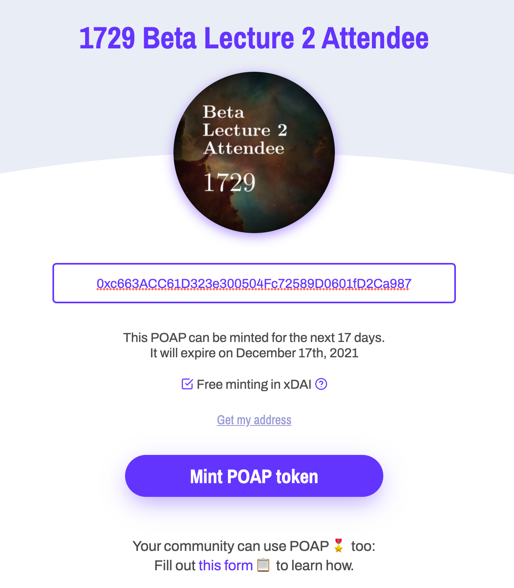
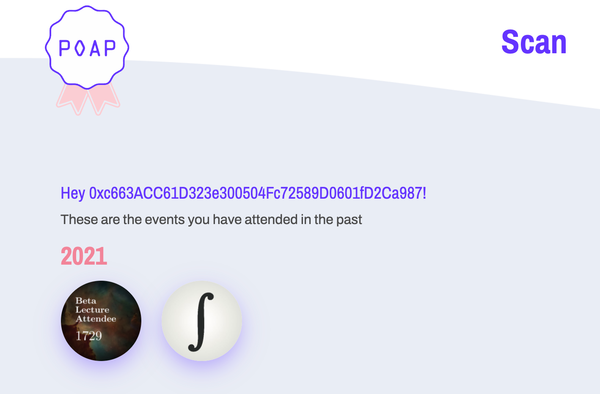

# How To Claim And View Your 1729 POAPs
When you attend a 1729 event in VR, we'll issue you a special NFT as proof of your attendance. This limited-run NFT credential is called a POAP (Proof Of Attendance Protocol), and it connects you with the other 1729 members who attended the event.

Using the unique URL we'll send you after you've filled out the event feedback form, you can mint this POAP to an Ethereum address of your choosing.

This guide will cover the following basics of minting and viewing your 1729 POAP NFTs:

1. Set up a Metamask wallet.
2. Claim and mint your POAP with your Metamask wallet and browser.
3. View your POAP on the web and in the POAP mobile app

We're using Google Chrome in this guide, because that's what we strongly recommend for the VR meetings. The steps below should work for other browsers, as well.

## Metamask

If you don't already have an Ethereum wallet you're comfortable using, we recommend [Metamask](https://metamask.io/). Metamask is a great first wallet that's available for multiple browsers, as well as iOS and Android.

Should you move on from Metamask, and want to transfer your POAPs to another wallet, it's possible to do this at the cost of some fees (depending on the network).

Once you install Metamask in your browser as an extension, it should be available in the usual place you find extensions. You can click on it to view your wallet:

If you click "Expand View" (see below) you'll get a larger, full-page view of the wallet. 

The main thing we'll need from Metamask is the Ethereum address for this wallet, so that we can mint our POAP to it. If you mouse over the account name in the middle ("Account 1" in these screenshots), you'll be able to copy that address to the by clicking it.

This address is public-facing, so for our purposes here there's no need to keep it particularly private or secure. We'll be pasting it into the POAP claim screen in order to mint our NFT.

A few quick notes before we move on:
- You do not need any ETH in your wallet in order to mint a POAP.
- When you mint your POAP using the recommended default settings, it will not show up in your Metamask wallet. You'll need to use the wallet in combination with [POAP scan](https://app.poap.xyz/scan/)  to view it.
- We don't need the POAP app for any part of this process, though we can use it to view POAPs we've minted to our Metamask wallet. (More on this, below.)

## Claiming and minting your POAP on the web

After you filled out the 1729 event feedback form, you should have received a claim link for a POAP. It should look something like this: `http://POAP.xyz/claim/ru0481`

If you paste your claim link into your browser, you'll see a page that looks something like the following:

Remember how we copied our Metamask address to the clipboard by clicking the account name in our wallet? Go ahead and do that now, and then paste that address into the claim box. This will mint yor POAP to the Ethereum address that's tied to your Metamask wallet.

But before you click, there's one thing you should know about what you're about to do: even though you're using your Ethereum address, _you won't actually be minting your POAP on the Ethereum blockchain_. 

Hover your mouse over the question mark icon next to the words "Free minting in xDAI," and you'll see the following pop-over:

What this means is that by default you'll actually be minting your POAP on an Ethereum sidechain called xDai. Minting your POAP to this low-cost sidechain has the following implications:

- You won't have to pay Ethereum's gas fees, or any transaction fees at all.
- If you do want your POAP on Ethereum mainnet, you can migrate it there at any time by putting ETH in your Metamask wallet to pay the gas fee (at the time of this writing, about $240 USD to mint a POAP on Ethereum mainnet).
- Your POAP won't be immediately visible in Metamask without some extra work.
- You can't easily transfer your POAP to a new wallet without jumping through some hoops and buying some xDai.

Unless you're really committed to having your POAP on the Ethereum mainnet and willing to pay significant gas fees, we recommend taking the default option and minting on xDai for free. You can always move to mainnet later.

## Viewing your POAP

There are a few ways to view your POAP collection.

On the web, you can go to the [POAP scan page](https://app.poap.xyz/scan/) and press the button to connect your Metamask wallet. (Or, you can enter an Ethereum address manually.) This will give you a view of all the POAPs you have in that wallet:

Clicking on one of your POAPs will take you to details for that particular POAP.

If you want to view your POAP on mobile, then you'll need to download the mobile app and enter the Ethereum address connected to your wallet. 

Once your wallet is connected, you'll be able to see any POAPs issued to that address.

For more advanced users, [this tutorial](https://www.publish0x.com/long-horizon/how-to-add-your-poaps-to-metamask-xyyyqrn) will show you how to connect Metamask to xDai and view your POAPs in Metamask.

## Using an ENS domain instead of a Metamask address

If you look at the [event page for Beta Lecture 3](https://poap.gallery/event/15646), you can that the list of wallets that minted POAPs for it are a mix of Ethereum addresses and .eth domain names:

Minting to an ENS domain name is a great option that's natively supported by POAP. If you have such a domain name, you can enter that instead of the Metamask wallet address into the claim page where you mint the POAP, and it will be associated with whatever wallet that domain points to.

You can find a good explanation of ENS, along with multiple tutorials for how to set it up for yourself, in [this 1729 task](https://1729.com/register-blockchain-domain-with-ens).

