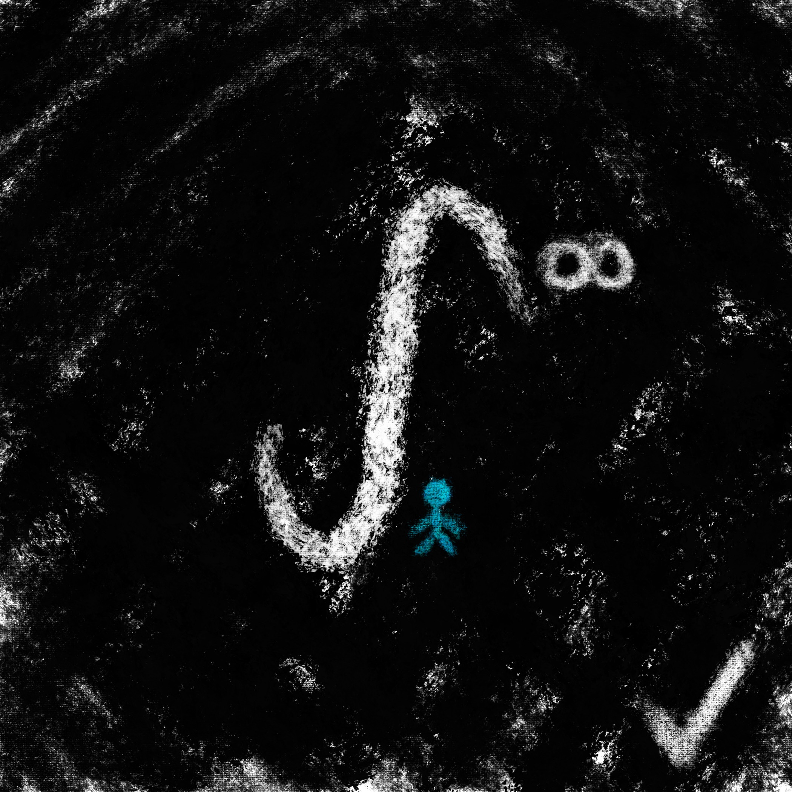

# 1729 POAP NFT Art Contest Entry

*Submitter*: little.prince

  
   
  To the extent possible under law,
  <a rel=""dct:publisher""
     href=""https://github.com/1729/content/blob/master/tasks/poap-nft-contest/entries/littleprince.md"">
    Joe Edwards</a>
  has waived all copyright and related or neighboring rights to
  1729 POAP NFT Art Contest Entry.
This work is published from:

  United States.

